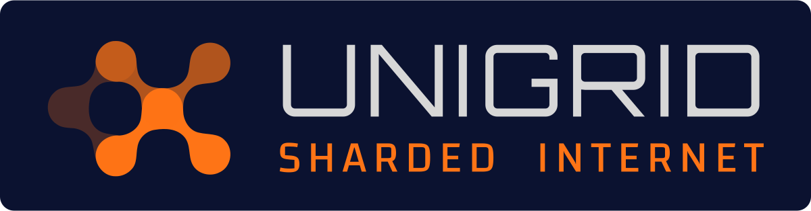

&nbsp;&nbsp;
&nbsp;&nbsp;
&nbsp;&nbsp;

### The next natural step in the evolution of the Internet

A load balanced network that is completely anonymous and resistant to eavesdropping.
Unigrid removes central points of failure and puts digital infrastructure in the hands of its community.

## 🛠️ What we're building

<table>
  <tr>
    <td width="50%" valign="top">
      
      <h3><a href="https://github.com/unigrid-project/hedgehog">🦔 Hedgehog</a></h3>
      A high-performance, QUIC-based, concurrent peer-to-peer treechain network built on Netty and Java NIO.
      The backbone of the next generation Unigrid platform.  
      
    </td>
    <td width="50%" valign="top">
      <h3><a href="https://github.com/unigrid-project/janus-java">🖥️ Janus</a></h3>
      The Unigrid Control Center: a desktop frontend to the Hedgehog and Unigrid networks.
      Installers for Linux, macOS and Windows.  
      
    </td>
  </tr>
  <tr>
    <td width="50%" valign="top">
      <h3><a href="https://unigrid-project.github.io/">📚 Documentation</a></h3>
      Guides and references for running nodes, building on the network and contributing.  
      
    </td>
    <td width="50%" valign="top">
      <h3><a href="https://github.com/unigrid-project/website">🌐 Website</a></h3>
      The main Unigrid website, open source like everything else we do.  
      
    </td>
  </tr>
</table>

## ✨ Principles

- 🔗 **Decentralized at the core:** no central point of failure, so the service stays resilient and uninterrupted.
- 🔒 **Private by design:** advanced protocols protect data and communications.
- 🤝 **Open and community driven:** contributions and ideas from around the globe are welcome.

## 🚀 Get involved

Developer, tech enthusiast or just passionate about decentralization, there is a place for you.
Browse the repositories, send a pull request, or [join the conversation on Discord](https://discord.gg/JDAYCJ9tEb).

Together, let's build a decentralized network that empowers individuals and transforms the way we interact with the digital world.

